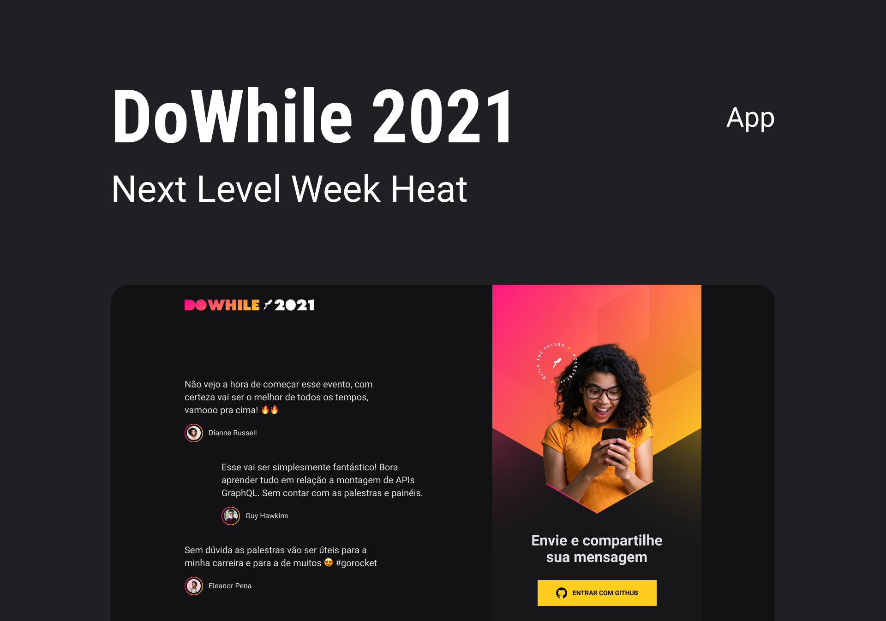

# Next Level Week - Heat (Trilha Impulse)



### SOBRE
Evento de programação organizado pela Rocketseat com duração de uma semana, onde são trabalhadas diversas tecnologias. A trilha Impulse que eu escolhi e na qual se baseia esse repositório foi baseada em uma aplicação fullstack desenvolvida em Node, React, React Native e Elixir (Backend, Web, Mobile e Microsserviços), na qual foram abordados temas como Websocket, ContextAPi do React, Autenticação OAuth do Github e muitos outros recursos.

### Instalação
Para instalar só precisa clonar este repositório e seguir as instruções no README.md de cada pasta.
``` bash
git clone https://github.com/danielvitorsm/nlw-heat
```

#### LINKS
https://www.rocketseat.com.br/
https://www.linkedin.com/school/rocketseat/